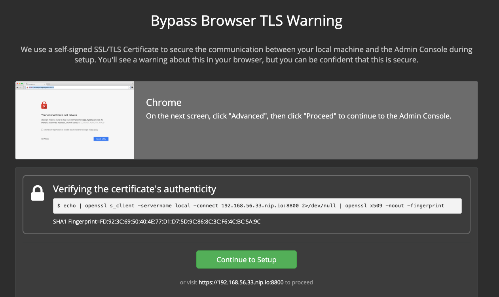
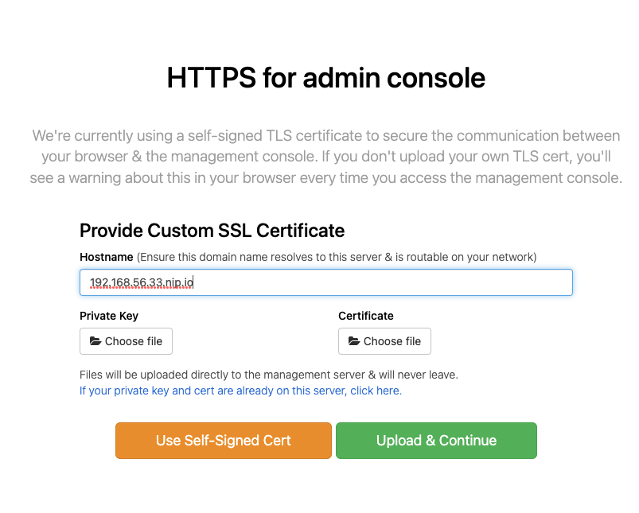
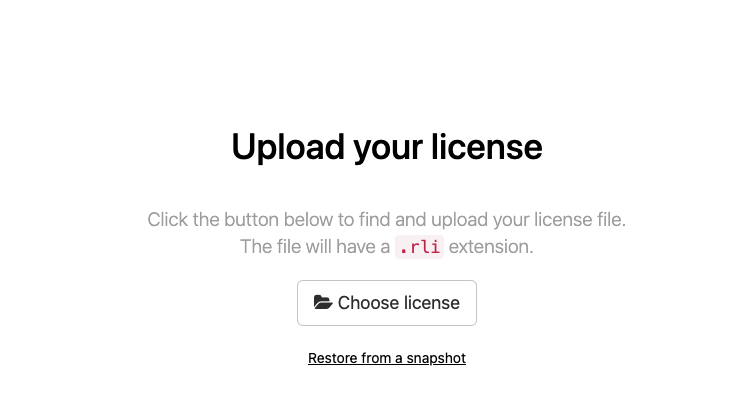
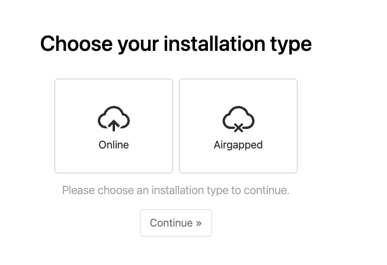
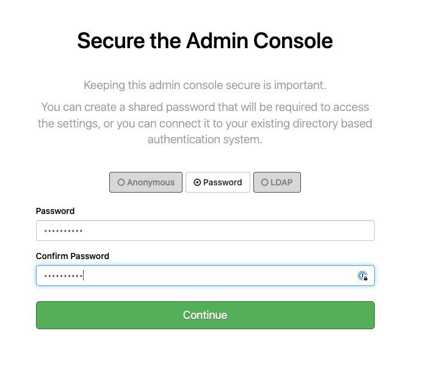
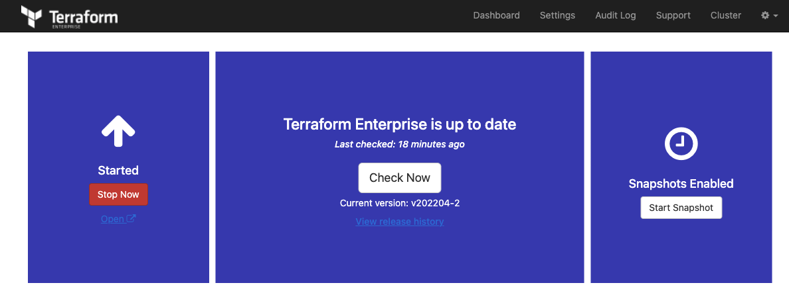
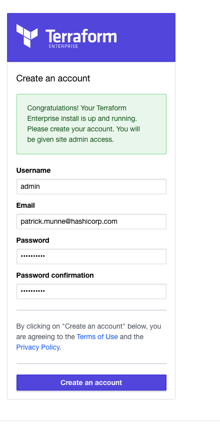
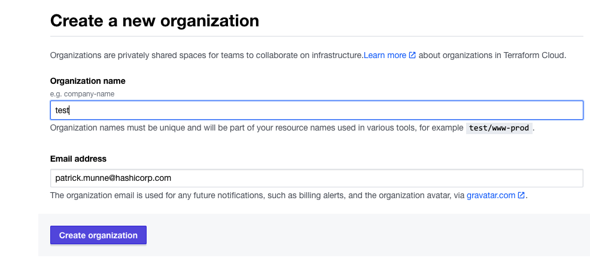

# manual installation TFE demo proxy with self signed certificates

This manual describes how to manually install TFE (Terraform Enterprise) with self-signed certificates and a proxy with self-signed certificates

For the official documentation [see this link](https://www.terraform.io/enterprise/install/interactive/installer)

Steps involved:
- Start a ubuntu machines (proxy + tfe) with Vagrant in Virtualbox
- install mitmproxy
- configure mitmproxy
- Install TFE
- Configure TFE basics

# Prerequisites

## Vagrant
Vagrant [See documentation](https://www.vagrantup.com/docs/installation)  
Virtualbox [See documentation](https://www.virtualbox.org/wiki/Downloads)

## License
Make sure you have TFE license available for use

# Proxy
Mitmproxy

# How to


- Start the Vagrant boxes
```
vagrant up
```
- login to the Vagrant box proxy
```
vagrant ssh proxy
```
- install the mitmproxy software
```
cd
curl https://snapshots.mitmproxy.org/8.0.0/mitmproxy-8.0.0-linux.tar.gz -o mitmproxy-8.0.0-linux.tar.gz.tar.gz
sudo tar -xvzf mitmproxy-8.0.0-linux.tar.gz.tar.gz -C /usr/local/bin/
```
- start the mitmproxy
```
mitmproxy
```
- you can see what the proxy is doing
- login to the Vagrant box tfe
```
vagrant ssh tfe
```
- get the self-signed certificates from the mitm-proxy
```
curl -v --proxy http://192.168.56.34:8080 -o proxy.pem http://mitm.it/cert/pem
sudo cp proxy.pem /usr/local/share/ca-certificates/proxy.crt
sudo update-ca-certificates
```
- set the proxy location for apt. Otherwise downloads of docker will fail
```
sudo cat <<-EOF > /etc/apt/apt.conf.d/proxy.conf 
Acquire {
  HTTP::proxy "http://192.168.56.34:8080";
  HTTPS::proxy "http://192.168.56.34:8080";
}
EOF
```
- create the directory to store TFE data in a mounted installation
```
sudo mkdir /mnt/tfe
sudo chown -R vagrant:vagrant /mnt/tfe/
```
```
export http_proxy=http://192.168.56.34:8080
export https_proxy=http://192.168.56.34:8080
export HTTP_PROXY=http://192.168.56.34:8080
export HTTPS_PROXY=http://192.168.56.34:8080


curl https://install.terraform.io/ptfe/stable > install.sh
sudo bash install.sh http-proxy=http://192.168.56.34:8080
```
- For the private ip address choose ```1```
```
Determining local address
The installer was unable to automatically detect the private IP address of this machine.
Please choose one of the following network interfaces:
[0] enp0s3	10.0.2.15
[1] enp0s8	192.168.56.33
Enter desired number (0-1): 1
```
- service IP address can be blank
```
Determining service address
The installer was unable to automatically detect the service IP address of this machine.
Please enter the address or leave blank for unspecified.
Service IP address: 
```
- No need for a proxy ```N```
```
Does this machine require a proxy to access the Internet? (y/N)
```
- Docker and all other things will be downloaded and installed
```
Operator installation successful

To continue the installation, visit the following URL in your browser:

  http://<this_server_address>:8800
```
- In a webbrowser go to the following link ```http://192.168.56.33.nip.io:8800```
- Click Continue to Setup    
    
- click advanced and ```proceed to 192.168.56.33.nip.io```  
- Configure the HTTPS for admin console with the following settings
    - hostname: ```192.168.56.33.nip.io```   
    - Use Self-Signed Cert   
    

- Upload your license ```<name>.rli```  
    
- Choose ```Online``` installation and click Continue  
       
- Choose password ```Password#1```  
    
- Preflight Checks should be good  
- You will get on the ```Settings``` page. Configure the below chapters   
    - Hostname: ```192.168.56.33.nip.io```  
    - Encryption password: ```Password#1```  
    - Installation Type: ```Demo```
    - Mounted Disk Path: ```/mnt/tfe```
    - SSL/TLS Configuration: ```add the CA bundle of the proxy server```
    - click ```save``` at the bottom of the page 
- On the dashboard you should see the Terraform is up and running and the link with open . This takes around 5 minutes to finish
     
- create a first account which will be the admin account  
    
- create your organization  
    
- You have a running TFE environment which you can use